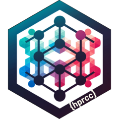

<!-- badges: start -->
[](https://lifecycle.r-lib.org/articles/stages.html#experimental)
[](https://github.com/cohmathonc/hprcc/actions/workflows/R-CMD-check.yaml)
<!-- badges: end -->

# hprcc 
  
An R Package to simplify running analyses on City of Hope clusters _Apollo_ and _Gemini_

## Features

**hprcc** configures [targets](https://books.ropensci.org/targets/) pipelines for COH clusters _Apollo_ and _Gemini_. Targets provides a simple but powerful framework for running R code. It avoids unnecessary computation for tasks that are up to date, natively supports parallel computing and abstracts R objects as files or cloud objects. The [autometric](https://wlandau.github.io/autometric/) package is used to gather resource usage metrics on the SLURM cluster.

You can easily configure your own SLURM resource requests (CPU, RAM, walltime) to run multiprocessor jobs on cluster nodes with `create_controller()` or use pre-configured shortcuts according to the job type:

| Job Type          | CPUs | Memory (GB)          | Time (minutes)    |
|-------------------|------|---------------------|------------------|
| tiny              | 2    | 8                   | 60               |
| small             | 2    | 20                  | 360              |
| medium            | 4    | 40                  | 360              |
| large             | 8    | 80                  | 360              |
| large_mem         | 8    | 800                 | 360              |
| xlarge            | 20   | 200                 | 360              |
| huge              | 40   | 200                 | 120              |
| gpu_medium^†^     | 4    | 60                  | 120              |
| gpu_large^†^      | 8    | 120                 | 240              |

^†^ GPUs only available on _Gemini_

For a complete list of configurable settings refer to the [package options](reference/package-options.html).

## Usage

Load the library via `_targets.R` and set resources within `targets::tar_target()` steps. By default, all targets will run on the cluster with a `small` allocation.

```
library(targets)
tar_script({
    options(hprcc.slurm_log=TRUE)
    library(hprcc)
    list(
        tar_target(y1, 1 + 1, deployment = "main"),
        tar_target(y2, 1 + 1, resources = tiny),
        tar_target(z, y1 + y2, resources = small)
    )}, ask = FALSE)
tar_make()
```

## Installation

To install this package, you can use the `remotes` package in R:

```r
if (!require("remotes")) install.packages("remotes")
remotes::install_github("cohmathonc/hprcc")
```

Or the development version:

```r
remotes::install_github("cohmathonc/hprcc", ref = "dev")
```

## Contributing

Contributions are welcome! If you have any suggestions for improvements or new features, please feel free to open an issue or submit a pull request.
